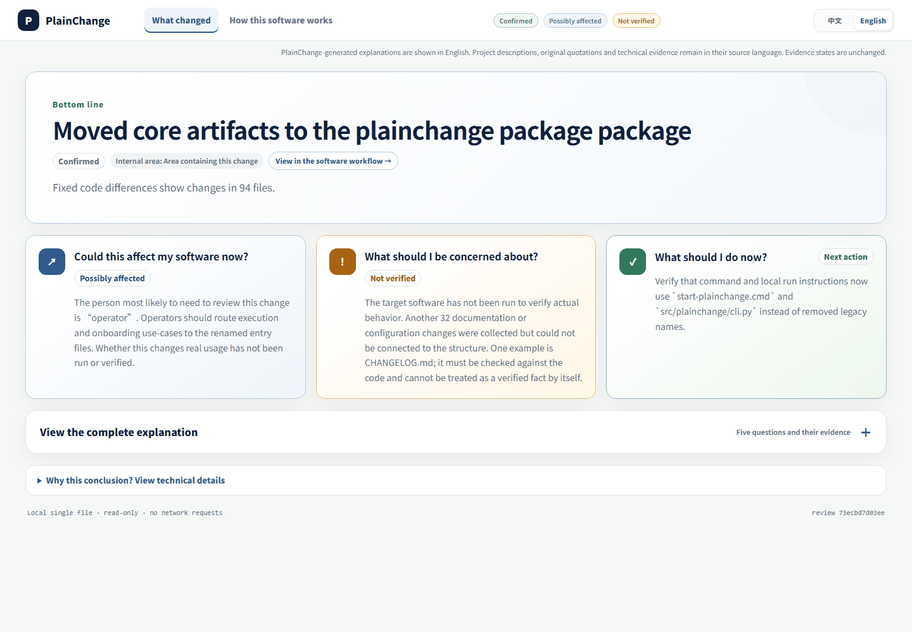

# PlainChange

English | [简体中文](README.zh-CN.md)

**Understand what changed — and where the code came from.**

Know what AI changed, what it affects, and what still needs verification.

PlainChange turns AI-made software changes into an evidence-backed **Change Passport**. It is for people responsible for software that AI helped build: founders, product owners, technical leads, and developers who cannot or do not want to review every changed line before deciding what to test or accept.

> AI can write the code. You should still be able to understand what changed in your software.

PlainChange is an early local-first Alpha. It does not edit the project being analysed, create an account, send telemetry, or require a preferred model vendor.

## See a real report



*A real local report produced by PlainChange while analysing its own previously
committed change. It shows **What changed**, then moves to **How this software
works** after 4 seconds. This model-assisted example first forms a bounded
project understanding, then explains the fixed change; PlainChange checks the
result against local evidence and still shows what remains unverified.*

## What you receive

Each offline report starts with the questions a software owner normally has:

1. What did AI change?
2. Could this affect my software or its users?
3. What should I be concerned about?
4. What should I check next?
5. Where did the new code come from? *(when Git AI has a record)*

Then it lets the reader move from the change to **how this software works**: the business workflow or capability map, the affected step, adjacent steps, and finally the source-backed technical evidence. Technical details are there when needed; they are not the default reading task.

When a fixed-range test, build, browser, integration, or security receipt is supplied, the report separates **already verified for you** from **what is still unverified and why**. Remaining checks name the minimum verification and who should handle it; PlainChange does not turn engineering commands into homework for the software owner.

### Know where the code came from with Git AI

When [Git AI](https://github.com/git-ai-project/git-ai) has recorded authorship for the selected commits, PlainChange reads that fixed-range record in read-only mode and adds **Where did this change come from?** to the same owner report. It distinguishes AI-recorded, human-recorded, and untracked additions, and shows sanitized tool/model names plus the number of recorded sessions.

The two tools answer different questions: Git AI records line-level provenance; PlainChange connects that provenance to the change, its possible impact, the evidence boundary, and the decision still left to the software owner. Provenance never becomes proof that the code is correct, ran successfully, or is safe to release.

Git AI remains optional. PlainChange does not install it, add hooks, reconstruct missing history, open transcripts, or send prompts and conversation bodies to the configured model. Install it using its official instructions and restart the supported coding agent so future edits can be recorded; PlainChange then discovers the installed command automatically.

## How it works

```text
fixed Git change + optional task context + optional Git AI provenance
                ↓
bounded project understanding (your configured model, if enabled)
                ↓
local evidence checks, source bounds, and explicit unknowns
                ↓
offline Change Passport: HTML + JSON + Markdown + architecture evidence
```

The full experience makes two semantic model calls: one to form a bounded project understanding, then one to explain the selected change. It then makes bounded translation calls to prepare the other supported language before the offline report is written. The model proposes language and salience; PlainChange still owns fixed Git collection, evidence IDs, source limits, downgrade rules, uncertainty, and report rendering. Translation is identity-bound and cannot upgrade static code into runtime proof.

Without a configured provider, PlainChange sends no network request and emits a clearly labelled **basic evidence** report instead. This is useful for private diagnostics, but it is not presented as a complete business understanding.

## Windows: download, unzip, double-click

The intended path for a software owner is a portable Windows download:

1. Download `PlainChange-windows-x64-portable.zip` from the GitHub Release.
2. Unzip it anywhere on your computer.
3. Double-click `PlainChange.exe`.
4. Choose the Git project, then enter your model endpoint, model name, and API key.

No terminal, Python, `uv`, JSON file, or environment variable is needed. The API key is
used only in PlainChange's process memory for that analysis; it is never written to the
project, report, log, local configuration, or Git. Closing the app clears it. The portable
app still needs Git installed because it compares committed versions.

The portable ZIP is built locally by `scripts/build-windows-portable.ps1`; attaching it to
a GitHub Release is a separate publishing step. Until an attachment is published, use the
source/developer path below.

## Source and developer path

Requirements: Git, Python 3.12+, and [uv](https://docs.astral.sh/uv/).

```powershell
git clone <your-fork-or-clone-url>
cd plainchange
uv sync --extra dev
uv run plainchange .
```

The last command compares the current repository's latest two commits and writes a report outside that target project. To use the guided local page:

```powershell
uv run plainchange serve
```

On Windows, `start-plainchange.cmd` starts the same local page. For another Git repository, either install PlainChange and run `plainchange .` inside that repository, or use:

```powershell
uv run plainchange analyze D:\path\to\a\git-project
```

See [installation and first use](docs/INSTALL.md) for wheel installation, ports, and troubleshooting.

## Advanced model configuration

PlainChange accepts a user-owned OpenAI-compatible endpoint. This can be a domestic, international, hosted, or local service; the project does not choose your provider or model. The portable first-run page accepts a masked API key directly and keeps it only in memory. The environment-variable JSON path below remains available for CLI and automation.

```powershell
Copy-Item examples\model-provider.template.json model-provider.local.json
$env:PLAINCHANGE_MODEL_API_KEY = "your-key"
uv run plainchange analyze D:\path\to\a\git-project --generator model --model-config model-provider.local.json --human-language auto
```

Put only the **environment variable name** in `api_key_env` inside the local JSON configuration. Never place a real key in that file or commit it. The configuration supports `json_schema`, `json_object`, and `prompt_only` structured-output compatibility modes. Model requests receive a bounded, fixed-revision context—not an unrestricted checkout—and stage receipts retain only sanitized identities, hashes, timing, and token counters.

`--human-language` accepts `auto`, `en`, or `zh-CN`. It selects the primary model language; `auto` follows the system language and the guided page follows the browser language. A model-assisted run now prepares the other supported language as an identity-bound report translation. English owner prose containing Chinese is rejected instead of being published as translated. Original project quotations, code paths, identifiers, and technical evidence remain in their source language.

## What PlainChange does not claim

- The target repository is always read-only. PlainChange reads fixed Git revisions and does not execute the target program.
- Static imports, changed files, and model interpretation do not prove runtime execution, deployment topology, database effects, network effects, or user impact.
- Project documentation is a project declaration, not ground truth. A matching code location means only that a fixed-version anchor was found.
- Generated workflows, audience candidates, and recommended checks are evidence-constrained proposals. They can be accepted, downgraded, or remain unknown; they never approve a baseline or a release by themselves.

Those limits are visible inside every report. “No evidence found” is not silently rewritten as “proved safe.”

## Languages and report text

The offline reader supports English and Simplified Chinese. It follows the browser/system preference on first open and remembers a manual choice locally. A model-assisted run writes both owner-facing languages before the report becomes offline: the requested language is the source, and bounded translation calls produce a complete identity-bound projection for the other language. Missing entries, stale identities, empty translations, or Chinese owner prose in the English projection fail closed. Original quotations, code paths, identifiers, and technical evidence remain unchanged in their source language.

Export and apply a source-bound translation pack with `localize-report`:

```powershell
plainchange localize-report .\artifacts\example --export translations.en.json --language en
# Translate every required entry without changing its uncertainty.
plainchange localize-report .\artifacts\example --translations translations.en.json
```

Translation packs are identity-bound to the source report. Coverage and identity are checked locally; translation quality still needs human review. The manual command remains available for deterministic reports or reviewed replacement translations.

## Generated artifacts

The report directory may contain:

- `review.html` — an offline, interactive owner-facing report.
- `brief.md` / `brief.json` — validated change explanation.
- `software-control.json` — the owner-oriented change and system view.
- `architecture-delta.json` / `system-architecture.json` — supported static structure snapshots, not runtime architecture.
- `project-understanding.json` — validated but non-authoritative model interpretation.
- `agent-provenance.json` — optional, sanitized Git AI authorship summary; never a correctness or runtime receipt.
- `report-translations.json` — complete identity-bound owner-text projection for the second language.
- `report-translation-run-receipt.json` — sanitized model, timing, batch, and token metadata for that projection.
- `run-receipt.json` and model-stage receipts — progress, timing, cache and sanitized provenance metadata.

Technical data is loaded on demand inside the offline report. Generated artifacts and local model configurations are ignored by Git by default.

## Current Alpha status

The core path has been exercised on framework, public-package, business-application, and media-production examples. It can distinguish a capability map from an ordered workflow, retain source-language evidence, and preserve runtime uncertainty. It is not yet a production assurance product:

- Independent non-technical comprehension studies are still pending.
- Model quality, latency, and token cost vary by provider and project.
- Dynamic language features, configuration injection, and runtime-only paths can remain unknown.
- There is no hosted service, IDE plugin, account system, telemetry, or automatic code editing.

Please treat Alpha reports as a stronger starting point for human review, not a replacement for running the software or making the release decision.

## Security, feedback, and contribution

Read [SECURITY.md](SECURITY.md) before analysing an untrusted repository. The local server listens only on loopback; do not share its local session URL or place credentials in reports, issues, or commits.

The project is released under the [MIT License](LICENSE). For this Alpha, report issues through the repository once its public remote is configured. Include the PlainChange version, operating system, steps to reproduce, and sanitized error output—never source code or credentials you cannot share.

For implementation, protocol, and validation details, see [installation and first use](docs/INSTALL.md), [the changelog](CHANGELOG.md), and [project governance records](docs/project-governance/README.md).
