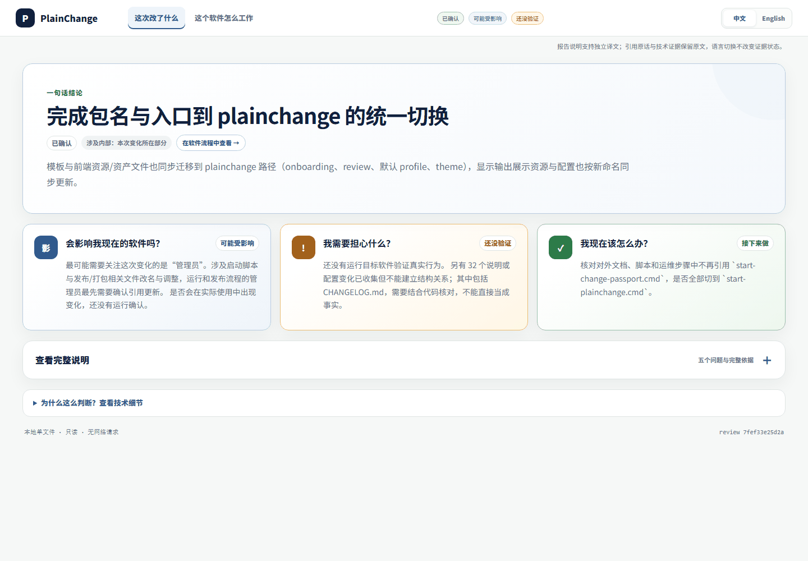

# PlainChange

[English](README.md) | 简体中文

**知道 AI 改了什么、影响什么，以及还有什么需要验证。**

PlainChange 是 AI 生成代码与人类决策之间的理解和控制层。它把一次 AI 参与的软件改动变成一份有证据支撑的 **Change Passport**。它面向需要对软件负责、却不可能逐行审查所有改动的人：创业者、产品负责人、技术负责人，以及大量使用 AI 编程的开发者。

> AI 可以写代码，但你仍应能知道它把软件改成了什么样。

PlainChange 目前是本地优先的早期 Alpha：不修改被分析项目、不需要账号、不发送遥测，也不绑定某一家模型供应商。

## 看一份真实报告



*这是 PlainChange 分析自身一段已提交改动时生成的本地真实报告：先展示“这次改了什么”，4 秒后切换到“这个软件怎么工作”。本例先由模型在边界内理解项目，再解释固定改动；PlainChange 会在本地核对证据，并继续标出尚未验证的部分。*

## 你会得到什么

每份离线报告先回答软件负责人真正关心的问题：

1. AI 这次改了什么？
2. 这会影响我的软件或用户吗？
3. 我需要担心什么？
4. 我接下来该检查什么？

之后，读者可以从一次变化继续理解**这个软件怎么工作**：它的业务流程或能力地图、变化所在步骤、上下游关系，最后才是有来源的技术证据。技术细节始终可查，但不是默认阅读负担。

## 它怎样工作

```text
固定 Git 改动 + 可选任务上下文
              ↓
有边界的项目理解（如已配置，使用你自己的模型）
              ↓
本地证据校验、来源范围与明确未知项
              ↓
离线 Change Passport：HTML + JSON + Markdown + 架构证据
```

完整体验会进行两次受约束的模型调用：先形成有边界的项目理解，再解释这一次固定改动。模型只负责提出语言与重要性判断；PlainChange 仍然掌握固定 Git 采集、证据 ID、来源范围、降级规则、不确定性和报告渲染。模型文字不能把静态代码升级成真实运行证明。

没有配置供应商时，PlainChange 不会发出任何网络请求，而是生成明确标注为**基础证据模式**的报告。它适合私密诊断，但不会被包装成已经完整理解业务。

## Windows：下载、解压、双击

面向软件负责人的正式入口是 Windows 便携包：

1. 在 GitHub Release 下载 `PlainChange-windows-x64-portable.zip`。
2. 解压到电脑任意位置。
3. 双击 `PlainChange.exe`。
4. 选择 Git 项目，再填写模型接口地址、模型名称和 API Key。

不需要终端、Python、`uv`、JSON 配置文件或环境变量。API Key 只在本次 PlainChange
进程内存中用于分析：不会写入项目、报告、日志、本地配置或 Git；关闭应用后即清除。便携版
仍需已安装 Git，因为它比较的是已提交的版本。

便携包由 `scripts/build-windows-portable.ps1` 在本机构建；将其附加到 GitHub Release 是
另一个发布步骤。在公开附件发布前，可使用下方源码/开发者路径。

## 源码与开发者路径

需要：Git、Python 3.12+ 与 [uv](https://docs.astral.sh/uv/)。

```powershell
git clone <你的 fork 或克隆地址>
cd plainchange
uv sync --extra dev
uv run plainchange .
```

最后一条命令比较当前项目最近两次提交，并在目标项目外生成报告。若想使用本地图形引导页：

```powershell
uv run plainchange serve
```

Windows 用户可以双击 `start-plainchange.cmd`。若要分析另一个 Git 项目，可以安装 PlainChange 后进入该项目运行 `plainchange .`，或者使用：

```powershell
uv run plainchange analyze D:\path\to\a\git-project
```

wheel 安装、端口与排障见[安装与首次使用](docs/INSTALL.md)。

## 高级模型配置

PlainChange 使用用户自己配置的 OpenAI-compatible 接口。无论国内、国外、托管还是本地服务，只要兼容该接口即可；项目不会替你选择供应商或模型。便携版首次使用页可直接填写掩码 API Key，并且只在内存中保存；下方环境变量 JSON 方式仍适用于 CLI 和自动化。

```powershell
Copy-Item examples\model-provider.template.json model-provider.local.json
$env:PLAINCHANGE_MODEL_API_KEY = "你的密钥"
uv run plainchange analyze D:\path\to\a\git-project --generator model --model-config model-provider.local.json --human-language auto
```

本地 JSON 的 `api_key_env` 只填写**保存密钥的环境变量名**。不要把真实密钥写入文件或提交。配置支持 `json_schema`、`json_object` 与 `prompt_only` 三种结构化输出兼容模式。发送给模型的是有边界、固定版本的上下文，而不是整份不受限检出；阶段收据只保留脱敏身份、哈希、耗时与 Token 计数。

`--human-language` 只接受 `auto`、`en` 或 `zh-CN`。`auto` 跟随系统语言；图形引导页跟随浏览器语言。要求英文时，如果模型仍混入中文的负责人说明，PlainChange 会拒绝该模型结果，而不会把它发布成英文报告。该规则只约束模型生成的说明；项目原文、原始引用、代码路径、标识符和技术证据仍保留来源语言。

## PlainChange 不会声称什么

- 目标仓库必须保持只读。PlainChange 只读取固定 Git 版本，不执行目标程序。
- 静态 import、改动文件和模型解释，都不能证明运行时执行、部署拓扑、数据库影响、网络影响或真实用户影响。
- 项目说明只是项目自己的声明，不是事实。找到对应代码只能说明固定版本中存在代码锚点。
- 自动生成的流程、角色候选和检查建议是受证据约束的提案；它们可以被接受、降级或保留为未知，不会自行批准 baseline 或发布。

这些边界会显示在每份报告中。“没有发现证据”不会被偷偷改写成“已经证明安全”。

## 语言与报告正文

离线阅读器只支持英文和简体中文。首次打开会跟随浏览器/系统偏好，手动选择后保存在本机。PlainChange 自己生成的界面和确定性提示会切换语言；模型增强报告会请求对应语言，并拒绝中英文混杂的模型负责人说明。引用原话、代码路径、标识符和技术证据保留原文，除非提供经过审阅的译文包。

用 `localize-report` 导出并应用与来源绑定的译文包：

```powershell
plainchange localize-report .\artifacts\example --export translations.en.json --language en
# 翻译全部必填项，且不得改变不确定性。
plainchange localize-report .\artifacts\example --translations translations.en.json
```

译文包绑定源报告身份，本地会校验覆盖度和身份；翻译的语义质量仍需人工审阅。

## 生成的产物

报告目录可能包含：

- `review.html`：离线、可交互的负责人报告。
- `brief.md` / `brief.json`：经证据校验的变化说明。
- `software-control.json`：面向负责人的变化视角与系统视角。
- `architecture-delta.json` / `system-architecture.json`：受支持的静态结构快照，不是运行时架构。
- `project-understanding.json`：已经本地校验、但不具事实权威的模型解释。
- `run-receipt.json` 及模型阶段收据：进度、耗时、缓存与脱敏来源信息。

技术数据在离线报告中按需加载。生成产物与本地模型配置默认会被 Git 忽略。

## 当前 Alpha 状态

核心链路已经在框架、公共包、业务应用和媒体生产项目上运行过：它能区分能力地图与有序流程，保留来源语言证据，并明确运行时未知项。但它还不是生产保证产品：

- 独立的非技术用户理解测试仍未完成。
- 模型质量、延迟和 Token 成本会随项目与供应商而变化。
- 动态语言特性、配置注入与只存在于运行时的路径仍可能未知。
- 当前没有云服务、IDE 插件、账号系统、遥测或自动修改代码能力。

请把 Alpha 报告当作更好的人工审查起点，而不是替代运行软件或做发布决定的工具。

## 安全、反馈与贡献

分析不受信任的项目之前请先阅读 [SECURITY.md](SECURITY.md)。本地服务只监听回环地址；不要分享本地会话链接，也不要在报告、Issue 或提交中放入密钥。

本项目采用 [MIT 许可证](LICENSE)。公共远端配置完成后，可通过仓库提交 Issue。请附上 PlainChange 版本、系统、复现步骤和已脱敏的错误输出；不要上传无法公开的源码或凭据。

实现、协议和验证细节见[安装文档](docs/INSTALL.md)、[更新记录](CHANGELOG.md)与[项目治理记录](docs/project-governance/README.md)。
